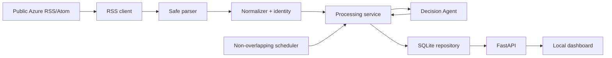

# Azure Incident Response Agent and Local Monitoring Dashboard

A local Python application that polls a configurable public Azure status feed, validates and deduplicates incidents, produces a structured operational assessment, persists the latest result in SQLite, and presents it through a FastAPI API and an accessible browser dashboard.

This project uses public/global status information. It does **not** read Azure tenant Service Health and must never be treated as proof of tenant-specific impact or as an automated remediation system.

## What it delivers

- Defensive RSS/Atom retrieval and parsing with finite timeout and bounded retry.
- Stable incident identity plus a separate material-content fingerprint.
- New/change/unchanged handling that analyzes only new or materially changed events.
- Provider-neutral Decision Agent prompts and strict schema validation.
- Deterministic fallback analysis when no LLM client is configured or a model fails.
- Atomic SQLite storage, filters, pagination, statistics, and restart persistence.
- Four local API endpoints and a no-build HTML/CSS/JavaScript dashboard.
- Non-overlapping startup/interval ingestion and browser polling.
- A fully offline, deterministic automated test suite and fixture demo.

## Architecture and data flow



One scheduler cycle fetches bytes, safely extracts valid entries, normalizes each incident, and looks up its stable ID. New and changed fingerprints are analyzed and atomically upserted; unchanged duplicates skip the agent. The dashboard reads only validated stored records through the API. RSS/agent failures preserve prior data and appear as degraded health.

### Module responsibilities

| Area | Modules | Responsibility |
|---|---|---|
| Configuration/logging | `app/config.py`, `app/logging_config.py` | Typed environment settings, safe defaults, secret redaction |
| Ingestion | `app/ingestion/` | Fetch, parse, sanitize, normalize, identify, fingerprint |
| Schemas | `app/models/schemas.py` | Enums and validated domain/API contracts |
| Decision Agent | `app/agents/` | Client protocol, prompts, strict validation, deterministic fallback |
| Persistence | `app/storage/` | SQLite schema, atomic upsert, lookup, filters, pagination, stats |
| Orchestration | `app/services/incident_service.py` | Deduplication, conditional analysis, per-entry isolation and cycle counts |
| Scheduling | `app/scheduler.py` | Startup/repeating cycles, overlap protection, lifecycle state |
| HTTP | `app/api/`, `main.py` | Lifecycle wiring, request IDs, errors, APIs, dashboard serving |
| Dashboard | `frontend/` | Safe DOM rendering, filters, detail, polling, stale/error states |

## Data contracts

Canonical schemas live in `app/models/schemas.py`:

- `RawIncident`: traceable source fields plus fetch/publication timestamps.
- `NormalizedIncident`: stable ID, material fingerprint, normalized status/services/regions.
- `AgentInput`: the intentionally narrow, untrusted evidence supplied to the agent.
- `IncidentAnalysis` and `ResponsePlan`: severity, confidence, impact, actions, rationale, warnings, and six response-plan sections.
- `IncidentRecord`, `IncidentListResponse`, `StatsResponse`, `HealthResponse`, `CycleResult`, and `ErrorResponse`: persistence and API envelopes.

All API timestamps are timezone-aware UTC and serialize with `Z`. External URLs, enum values, confidence, required text, list items, and incident-ID consistency are validated at boundaries.

## Install

Prerequisites: Python 3.11 or later. Node.js 20 or later is recommended for the direct dashboard polling test; the Python suite reports clearly if it is unavailable.

```bash
git clone https://github.com/tuzhechen2005/task4-azure-incident-agent.git
cd task4-azure-incident-agent
python3 -m venv .venv
.venv/bin/python -m pip install --upgrade pip
.venv/bin/python -m pip install -r requirements.txt
cp .env.example .env
```

Never put a real credential in a committed file. `.env`, databases, caches, logs, virtual environments, reports, archives, and build outputs are ignored.

## Run locally

The safe default is fallback-only analysis (`LLM_PROVIDER=none`, blank `LLM_API_KEY`):

```bash
.venv/bin/python main.py
```

Open <http://127.0.0.1:8000/>. The server runs one ingestion cycle at startup, then every configured interval. Stop it with `Ctrl-C`.

The bundled implementation intentionally ships without a vendor SDK adapter. `LLMClient` is the provider-neutral integration boundary; local operation uses the validated deterministic fallback. Keep `LLM_API_KEY` blank unless a reviewed adapter is added behind that protocol.

## Offline dashboard demo

This demo never calls a live feed or LLM. It seeds two fixture incidents, then starts the application against an unavailable loopback RSS address so stored data remains visible while health correctly shows degradation.

```bash
.venv/bin/python -m scripts.seed_demo --database data/demo.db
DATABASE_PATH=data/demo.db \
AZURE_STATUS_RSS_URL=http://127.0.0.1:9/offline \
RSS_TIMEOUT_SECONDS=1 \
RSS_MAX_RETRIES=0 \
LLM_PROVIDER=none \
LLM_API_KEY= \
.venv/bin/python -m uvicorn main:app --host 127.0.0.1 --port 8000
```

Then open <http://127.0.0.1:8000/>. Re-running the seed command demonstrates idempotent duplicate handling.

## Configuration reference

| Variable | Default | Validation / purpose |
|---|---|---|
| `AZURE_STATUS_RSS_URL` | `https://azure.status.microsoft/en-us/status/feed/` | Configurable HTTP(S) public feed URL |
| `RSS_TIMEOUT_SECONDS` | `10` | Positive per-request timeout |
| `RSS_MAX_RETRIES` | `1` | Non-negative bounded retry count |
| `INGESTION_INTERVAL_SECONDS` | `300` | Positive scheduler interval |
| `DASHBOARD_POLL_SECONDS` | `30` | Positive browser refresh interval injected into `/` |
| `DATABASE_PATH` | `data/incidents.db` | Nonblank local file path, not a directory |
| `LLM_PROVIDER` | `none` | Provider label; bundled runtime remains fallback-only |
| `LLM_MODEL` | empty | Optional provider model/deployment label |
| `LLM_API_KEY` | empty | Secret value; blank enables fallback-only operation |
| `LLM_TIMEOUT_SECONDS` | `30` | Positive provider timeout boundary |
| `LLM_MAX_RETRIES` | `1` | Non-negative repair/provider retry limit |
| `LOG_LEVEL` | `INFO` | `CRITICAL`, `ERROR`, `WARNING`, `INFO`, or `DEBUG` |

Invalid values fail at startup with actionable validation errors.

## API

| Method/path | Result |
|---|---|
| `GET /api/health` | Database/scheduler state, analysis mode, ingestion timestamps, safe last error; RSS/fallback degradation is `200`, unavailable SQLite is `503` |
| `GET /api/stats` | Total, status/severity counts, latest incident and ingestion timestamps |
| `GET /api/incidents` | Ordered list with `page`, `page_size` (maximum 100), optional `severity`, `status`, `service`, `region` |
| `GET /api/incidents/{incident_id}` | One normalized incident and latest analysis; missing IDs return `404 INCIDENT_NOT_FOUND` |

Examples:

```bash
curl -s http://127.0.0.1:8000/api/health
curl -s 'http://127.0.0.1:8000/api/incidents?severity=SEV-3&page=1&page_size=20'
```

Errors include a request ID and never expose stack traces, response bodies, credentials, or database locations.

## Decision Agent and prompt strategy

The system prompt defines the four-level severity rubric, non-invention rule, public-status limitation, concise style, and strict JSON-only output. Validated `AgentInput` is serialized deterministically inside explicit untrusted-data delimiters; instructions embedded in feed text must not be followed. Model output is parsed as one JSON object, schema-validated, and checked against the input incident ID. Application-owned timestamp/source/model metadata is set at the boundary.

At most the configured repair/retry count is attempted. Invalid JSON/schema, wrong ID, timeout, provider error, missing credentials, or exhausted repair produces a complete deterministic `FALLBACK` analysis. Active/monitoring uncertainty defaults to `SEV-3`; resolved/unknown information defaults to `SEV-4`, with low confidence, verification steps, escalation conditions, and explicit warnings.

## Dashboard behavior

The browser loads health, stats, and up to 100 latest incidents immediately and every `DASHBOARD_POLL_SECONDS`. One refresh cannot overlap another. Selecting an incident fetches its detail endpoint. A failed refresh keeps the last good list/detail visible, marks it stale, and offers manual retry; recovery clears stale/error state. Loading, empty, no-selection, selected, stale, and error states are explicit.

All RSS/model text is assigned through `textContent` or created text nodes—never dynamic HTML. Severity always includes a text label in addition to color. Native buttons/forms, visible focus, semantic regions, an accessible table, and responsive layouts support keyboard and narrow-screen use.

## Failure behavior

| Failure | Behavior |
|---|---|
| RSS timeout/network/HTTP/empty body/invalid XML | Record a safe degraded cycle, preserve SQLite data, keep API/dashboard available |
| One malformed entry | Skip it, count a failure, continue valid siblings |
| Unchanged duplicate | Skip analysis and keep one record |
| Changed incident | Re-analyze and atomically replace the latest record |
| Missing/failed/invalid LLM | Persist a valid conservative fallback |
| SQLite write failure | Roll back that record and continue when safe |
| Unknown ID | Standard request-ID `404` envelope |
| Dashboard API failure | Retain last good content, show stale/error, allow retry |

## Test and quality commands

The default suite is deterministic and offline: all RSS/LLM dependencies are fixtures or fakes, clocks/timers are injected, and databases are temporary.

```bash
.venv/bin/python -m pytest -q
node --test tests/frontend/test_dashboard_polling.js
.venv/bin/ruff format --check app scripts tests main.py
.venv/bin/ruff check app scripts tests main.py
.venv/bin/mypy app scripts tests main.py
node --check frontend/app.js
```

## Project structure

```text
app/                 configuration, schemas, ingestion, agent, storage, service, scheduler, API
frontend/            no-build dashboard HTML, CSS, JavaScript
scripts/             deterministic offline demo seeding
tests/unit/          isolated domain/component tests
tests/integration/   API and complete fixture pipeline tests
tests/frontend/      accessibility/static and Node polling tests
tests/fixtures/      local RSS and dashboard data
docs/                project retrospective
SPEC.md              approved product/technical contract and final AC checklist
TASKS.md             ordered implementation plan and statuses
progress.md          task checkpoints, problems, decisions, validation, commits/pushes
```

## Troubleshooting

- `No module named ...`: activate/use `.venv/bin/python` and reinstall `requirements.txt`.
- Startup configuration error: compare `.env` with `.env.example`; timeouts/intervals must be positive and retries non-negative.
- Health is `degraded` in local mode: expected when fallback-only is active or RSS is unavailable; stored data remains usable.
- Health is `503`: verify the parent of `DATABASE_PATH` is writable and the path is not a directory.
- Dashboard is empty: check `/api/health`, then `/api/stats`; run the offline seed command to create deterministic records.
- Port 8000 is busy: use `.venv/bin/python -m uvicorn main:app --port 8001` and open that port.
- Polling test cannot find Node: install Node 20+ or run the Python/API tests separately; delivery validation expects Node.

## Security and limitations

- External content is untrusted, sanitized, validated, and rendered as text.
- Secrets belong only in environment variables and are redacted from configured logs.
- Public RSS is global, can change format/URL, and may lag; it is not tenant Service Health.
- Service/region extraction is deliberately conservative and based on a small known-name catalog.
- The process-local scheduler is not distributed; the application is designed for one local server process.
- SQLite and the dashboard are local and unauthenticated; do not expose the server to an untrusted network.
- The repository provides the LLM protocol and validated agent behavior but no vendor-specific production adapter.

See [SPEC.md](SPEC.md), [TASKS.md](TASKS.md), [progress.md](progress.md), and [the retrospective](docs/RETROSPECTIVE.md) for traceable design and delivery evidence.
