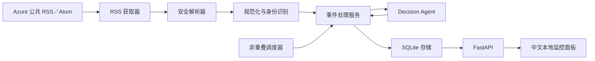

# Azure 事件响应智能体与本地监控面板

这是一个本地运行的 Python 应用。它定时读取可配置的 Azure 公共状态订阅源，对事件进行校验、去重和结构化研判，将最新结果保存到 SQLite，并通过 FastAPI 接口和无构建步骤的浏览器面板展示。

本项目使用的是全球公共状态信息，**不会读取 Azure 租户级 Service Health**。它不能证明某个租户一定受到影响，也不会自动执行修复操作。

## 功能概览

- 带超时和有限重试的 RSS／Atom 获取与防御性解析。
- 将稳定事件标识与内容变化指纹分离。
- 新事件写入、变化事件重新分析、未变化事件跳过分析。
- 提供商无关的 Decision Agent 协议、严格结构校验和中文提示词。
- 未配置 LLM 或模型失败时，生成确定性的中文保守备用分析。
- SQLite 原子存储、筛选、分页、统计和重启持久化。
- 四个本地 API 端点和中文无障碍监控面板。
- 启动时采集、定时采集、避免任务重叠及浏览器自动轮询。
- 完全离线、确定性的自动化测试和演示数据。

## 架构与数据流



一次调度周期会获取订阅源字节、安全提取有效条目、规范化事件并查询稳定 ID。新事件和内容指纹发生变化的事件会被分析并原子写入；未变化的重复事件会跳过智能体。网页只通过 API 读取已校验并存储的数据。RSS 或智能体失败不会清空旧数据，健康接口会将当前状态标记为降级。

### 模块职责

| 模块 | 路径 | 职责 |
|---|---|---|
| 配置与日志 | `app/config.py`、`app/logging_config.py` | 类型化环境配置、安全默认值、密钥脱敏 |
| 数据采集 | `app/ingestion/` | 获取、解析、清洗、规范化、身份和指纹生成 |
| 数据结构 | `app/models/schemas.py` | 枚举以及领域／API 校验契约 |
| Decision Agent | `app/agents/` | 客户端协议、中文输出提示词、严格校验、确定性备用分析 |
| 数据存储 | `app/storage/` | SQLite 表结构、原子更新、查询、筛选、分页和统计 |
| 业务编排 | `app/services/incident_service.py` | 去重、条件分析、逐条隔离和周期计数 |
| 调度 | `app/scheduler.py` | 启动与周期采集、防重叠、生命周期状态 |
| HTTP | `app/api/`、`main.py` | 生命周期、请求 ID、错误处理、API 和网页托管 |
| 网页 | `frontend/` | 中文安全渲染、筛选、详情、轮询、过期／错误状态 |

## 数据契约

规范数据结构位于 `app/models/schemas.py`：

- `RawIncident`：保留来源字段、获取时间和发布时间。
- `NormalizedIncident`：稳定 ID、内容指纹、规范状态、服务和区域。
- `AgentInput`：传给智能体的最小化、不可信事件证据。
- `IncidentAnalysis`、`ResponsePlan`：严重级别、置信度、影响、建议、依据、警告和六部分响应计划。
- `IncidentRecord`、`IncidentListResponse`、`StatsResponse`、`HealthResponse`、`CycleResult`、`ErrorResponse`：存储和 API 响应结构。

所有 API 时间均为带时区的 UTC，并以 `Z` 结尾。外部 URL、枚举值、置信度、必填文本、列表元素和事件 ID 一致性都会在边界处校验。

## 安装

前置条件：Python 3.11 或更高版本。建议安装 Node.js 20 或更高版本，用于直接运行网页轮询测试。

```bash
git clone https://github.com/tuzhechen2005/task4-azure-incident-agent.git
cd task4-azure-incident-agent
python3 -m venv .venv
.venv/bin/python -m pip install --upgrade pip
.venv/bin/python -m pip install -r requirements.txt
cp .env.example .env
```

不要把真实凭据写入会提交的文件。`.env`、数据库、缓存、日志、虚拟环境、测试报告、压缩包和构建产物均已加入忽略规则。

## 本地运行

默认配置使用纯本地备用分析：`LLM_PROVIDER=none`，`LLM_API_KEY` 留空。

```bash
.venv/bin/python main.py
```

浏览器访问 <http://127.0.0.1:8000/>。服务会在启动时执行一次采集，然后按配置的间隔继续运行。按 `Ctrl-C` 可安全停止。

当前交付版本没有捆绑任何厂商 SDK 适配器。`LLMClient` 是提供商无关的扩展边界；本地运行使用经过校验的确定性备用分析。除非已经增加并审查适配器，否则请保持 `LLM_API_KEY` 为空。

## 离线监控面板演示

以下流程不会访问真实订阅源或 LLM。它先写入两条固定测试事件，再让应用连接一个不可用的本地 RSS 地址，因此历史数据仍然可见，同时健康状态会正确显示为降级。

```bash
.venv/bin/python -m scripts.seed_demo --database data/demo.db
DATABASE_PATH=data/demo.db \
AZURE_STATUS_RSS_URL=http://127.0.0.1:9/offline \
RSS_TIMEOUT_SECONDS=1 \
RSS_MAX_RETRIES=0 \
LLM_PROVIDER=none \
LLM_API_KEY= \
.venv/bin/python -m uvicorn main:app --host 127.0.0.1 --port 8000
```

随后访问 <http://127.0.0.1:8000/>。重复执行播种命令后，数据库仍然只有两条记录，可用于验证去重行为。

## 配置参考

| 环境变量 | 默认值 | 校验与用途 |
|---|---|---|
| `AZURE_STATUS_RSS_URL` | `https://azure.status.microsoft/en-us/status/feed/` | 可配置的 HTTP(S) 公共状态订阅源 |
| `RSS_TIMEOUT_SECONDS` | `10` | 正数；单次请求超时秒数 |
| `RSS_MAX_RETRIES` | `1` | 非负整数；有限重试次数 |
| `INGESTION_INTERVAL_SECONDS` | `300` | 正数；后台采集间隔 |
| `DASHBOARD_POLL_SECONDS` | `30` | 正数；网页刷新间隔，会注入 `/` 页面 |
| `DATABASE_PATH` | `data/incidents.db` | 非空本地文件路径，不能指向目录 |
| `LLM_PROVIDER` | `none` | 提供商标识；捆绑运行时仍为备用分析模式 |
| `LLM_MODEL` | 空 | 可选的模型或部署名称 |
| `LLM_API_KEY` | 空 | 密钥；为空时启用备用分析 |
| `LLM_TIMEOUT_SECONDS` | `30` | 正数；模型调用超时边界 |
| `LLM_MAX_RETRIES` | `1` | 非负整数；模型修复／重试次数 |
| `LOG_LEVEL` | `INFO` | 可选 `CRITICAL`、`ERROR`、`WARNING`、`INFO`、`DEBUG` |

无效配置会在启动时停止，并给出可操作的校验错误。

## API 接口

API 字段名保持英文，方便程序稳定集成；网页展示文本为中文。

| 方法与路径 | 返回内容 |
|---|---|
| `GET /api/health` | 数据库／调度器状态、分析模式、采集时间和安全错误摘要；RSS 或备用模式降级返回 `200`，SQLite 不可用返回 `503` |
| `GET /api/stats` | 事件总数、状态／级别计数、最新事件和采集时间 |
| `GET /api/incidents` | 有序列表；支持 `page`、`page_size`（最大 100）、`severity`、`status`、`service`、`region` |
| `GET /api/incidents/{incident_id}` | 单个规范化事件和最新分析；不存在时返回 `404 INCIDENT_NOT_FOUND` |

示例：

```bash
curl -s http://127.0.0.1:8000/api/health
curl -s 'http://127.0.0.1:8000/api/incidents?severity=SEV-3&page=1&page_size=20'
```

错误响应包含请求 ID，不会泄露堆栈、响应正文、凭据或数据库位置。

## Decision Agent 与提示词策略

系统提示词定义四级严重程度、禁止臆测规则、公共状态局限、简体中文输出要求和严格 JSON 契约。经过校验的 `AgentInput` 会被确定性序列化，并放入明确的不可信数据边界；订阅源正文中的指令不会被执行。模型结果必须是一个 JSON 对象，通过结构校验，并与输入事件 ID 一致。时间、来源和模型元数据由应用代码控制。

系统只执行配置数量的修复／重试。JSON 或结构无效、ID 错误、超时、提供商错误、缺少凭据或重试耗尽时，都会生成完整的中文 `FALLBACK` 分析。处理中或监控中的不确定事件默认使用 `SEV-3`；已解决或信息不足的事件默认使用 `SEV-4`，并附带低置信度、核实步骤、升级条件和明确提示。

## 监控面板行为

浏览器首次打开后立即请求健康状态、统计数据和最多 100 条最新事件，随后按 `DASHBOARD_POLL_SECONDS` 自动刷新。刷新不会重叠。选择事件时会请求详情接口。刷新失败会保留最近一次成功的列表和详情，并显示数据过期和重试提示；恢复后自动清除错误状态。

加载中、空列表、未选择、已选择、数据过期和错误状态均有中文提示。所有 RSS／模型文本都通过 `textContent` 或文本节点写入，不会作为动态 HTML 执行。严重级别同时显示文字和颜色。原生按钮、表单、可见焦点、语义区域、无障碍表格和响应式布局支持键盘及窄屏使用。

## 失败处理

| 故障 | 系统行为 |
|---|---|
| RSS 超时、网络／HTTP 错误、空正文、无效 XML | 记录安全的降级周期，保留 SQLite 数据，API 和网页继续可用 |
| 单条格式错误 | 跳过该条、计入失败，继续处理其他有效条目 |
| 未变化的重复事件 | 跳过分析，只保留一条记录 |
| 内容发生变化 | 重新分析并原子替换最新记录 |
| LLM 缺失、失败或输出无效 | 保存有效、保守的中文备用分析 |
| SQLite 写入失败 | 回滚当前记录，在安全情况下继续处理 |
| 事件 ID 不存在 | 返回带请求 ID 的标准 `404` 错误 |
| 网页 API 请求失败 | 保留最近成功内容，显示过期／错误状态并允许重试 |

## 测试与质量检查命令

默认测试完全离线且结果确定：RSS／LLM 使用固定数据或假对象，时钟、计时器和数据库均可注入或隔离。

```bash
.venv/bin/python -m pytest -q
node --test tests/frontend/test_dashboard_polling.js
.venv/bin/ruff format --check app scripts tests main.py
.venv/bin/ruff check app scripts tests main.py
.venv/bin/mypy app scripts tests main.py
node --check frontend/app.js
```

## 项目结构

```text
app/                 配置、结构、采集、智能体、存储、服务、调度和 API
frontend/            无构建步骤的中文 HTML、CSS、JavaScript 面板
scripts/             确定性的离线演示播种工具
tests/unit/          领域和组件单元测试
tests/integration/   API 与完整固定数据流水线测试
tests/frontend/      无障碍／静态检查和 Node 轮询测试
tests/fixtures/      本地 RSS 与监控面板测试数据
docs/                中文项目复盘
SPEC.md              已批准的产品／技术契约与最终验收清单
TASKS.md             按依赖排序的任务计划和状态
progress.md          任务节点、问题、决策、验证、提交和推送记录
```

## 常见问题排查

- 出现 `No module named ...`：使用 `.venv/bin/python`，并重新安装 `requirements.txt`。
- 启动时配置校验失败：将 `.env` 与 `.env.example` 对比；超时和间隔必须为正数，重试次数不能为负。
- 本地模式显示“降级”：备用分析开启或 RSS 不可用时属于预期行为，已保存的数据仍可使用。
- 健康接口返回 `503`：检查 `DATABASE_PATH` 父目录是否可写，并确认路径没有指向目录。
- 面板没有数据：先查看 `/api/health` 和 `/api/stats`，再运行离线播种命令。
- 8000 端口被占用：运行 `.venv/bin/python -m uvicorn main:app --port 8001` 并访问新端口。
- 找不到 Node：安装 Node 20+；Python／API 测试仍可单独运行。

## 安全与限制

- 外部内容一律视为不可信数据，会经过清洗、校验并以纯文本渲染。
- 密钥只能来自环境变量，日志配置会对密钥值进行脱敏。
- 公共 RSS 是全球信息，格式和 URL 可能变化或延迟，不能替代租户 Service Health。
- 服务和区域提取基于小型已知名称表，策略有意保持保守。
- 调度器只保护单进程内的任务重叠，不适用于分布式调度。
- SQLite 和监控面板仅面向本地使用且没有身份验证，不要暴露到不可信网络。
- 仓库提供 LLM 协议和校验完备的智能体行为，但没有厂商专用生产适配器。

更多设计和交付证据请查看 [SPEC.md](SPEC.md)、[TASKS.md](TASKS.md)、[progress.md](progress.md) 和[项目复盘](docs/RETROSPECTIVE.md)。
