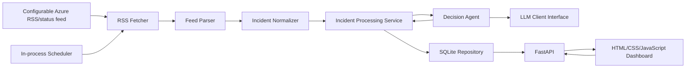
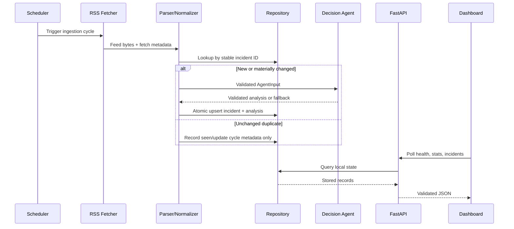

# Azure Incident Response Agent and Local Monitoring Dashboard — Specification

## 1. Document Purpose

This document is the product and technical specification for a local application that retrieves public Azure service incident information, normalizes and deduplicates it, uses a Decision Agent to produce a structured incident assessment and response plan, stores the results, and displays them in a local monitoring dashboard.

This specification defines **what must be built**. `AGENTS.md` defines **how AI contributors must work**, and `TASKS.md` defines **the implementation sequence**. No business code is part of this specification phase.

## 2. Scope and Design Decisions

### 2.1 In scope

- Poll a configurable public Azure status/RSS feed on a schedule.
- Parse incident entries and retain their source traceability.
- Normalize inconsistent feed fields into validated domain models.
- Detect duplicates and updates to previously seen incidents.
- Analyze each new or changed incident through a structured Decision Agent.
- Assign one severity level from `SEV-1` through `SEV-4`.
- Generate business impact, recommended actions, and a standardized response plan.
- Persist normalized incidents and analyses locally in SQLite.
- Expose health, incident, detail, and summary-statistics APIs through FastAPI.
- Serve a local dashboard built with HTML, CSS, and vanilla JavaScript.
- Run ingestion periodically while the application is active.
- Remain usable when RSS or LLM dependencies are temporarily unavailable.
- Include setup documentation and a project retrospective for the final ZIP deliverable.

### 2.2 Out of scope

- Azure tenant authentication or private Azure Service Health events.
- Automated remediation, ticket creation, paging, email, or chat notifications.
- Production high availability, distributed scheduling, or multi-user authorization.
- Kubernetes, Redis, Kafka, a frontend framework, or a separate database server.
- Training or fine-tuning a model.
- Claiming that public RSS gives tenant-specific impact.

### 2.3 Fixed defaults

- Runtime: Python 3.11 or later.
- API: FastAPI with Uvicorn for local execution.
- Persistence: one local SQLite database.
- HTTP and RSS parsing: small Python libraries selected during implementation and isolated behind interfaces.
- Frontend: one local HTML/CSS/JavaScript application served by the backend.
- Ingestion interval: 300 seconds by default, configurable.
- Dashboard refresh interval: 30 seconds by default, configurable.
- Timestamps: timezone-aware ISO 8601 in UTC, ending in `Z` in JSON responses.
- API prefix: `/api`.

## 3. Requirements

### 3.1 Functional requirements

| ID | Requirement |
|---|---|
| FR-001 | The system shall load configuration from environment variables with safe local defaults and validate invalid values at startup. |
| FR-002 | The system shall fetch a configurable Azure public RSS/status source with a finite timeout and identifiable user agent. |
| FR-003 | The system shall parse zero or more feed entries without allowing one malformed entry to terminate the whole cycle. |
| FR-004 | The system shall retain source URL, source entry ID, link, raw title/description, publication time, and fetch time where available. |
| FR-005 | The system shall normalize parsed entries into a consistent validated incident schema. |
| FR-006 | The system shall derive a stable incident ID, preferring the feed's stable ID and otherwise using a deterministic content fingerprint. |
| FR-007 | The system shall insert new incidents, update changed incidents, and avoid re-analyzing unchanged duplicates. |
| FR-008 | The Decision Agent shall identify affected services, regions, scope, status, severity, summary, potential impact, actions, response plan, and rationale. |
| FR-009 | Decision Agent output shall be strict structured JSON validated against the schema in this document. |
| FR-010 | Invalid, timed-out, or failed LLM output shall produce a deterministic fallback analysis rather than crash ingestion. |
| FR-011 | The system shall persist normalized incidents, their latest analysis, source fingerprint, and timestamps in SQLite. |
| FR-012 | A scheduler shall run one ingestion cycle at startup and repeat it at the configured interval without overlapping cycles. |
| FR-013 | The API shall expose application/dependency health at `GET /api/health`. |
| FR-014 | The API shall expose filterable and paginated incidents at `GET /api/incidents`. |
| FR-015 | The API shall expose one incident and its analysis at `GET /api/incidents/{incident_id}`. |
| FR-016 | The API shall expose counts and latest-update information at `GET /api/stats`. |
| FR-017 | The dashboard shall show system state, severity summary, incident list, selected incident detail, analysis, impact, actions, response plan, source link, and last update. |
| FR-018 | The dashboard shall poll the API periodically, update without a full-page reload, and show loading, empty, stale, and error states. |
| FR-019 | Operational logs shall record ingestion, parsing, deduplication, analysis, persistence, scheduler, and API errors without secrets. |
| FR-020 | The final project shall include local run instructions, configuration reference, architecture explanation, prompt strategy, limitations, and retrospective. |

### 3.2 Non-functional requirements

| ID | Requirement |
|---|---|
| NFR-001 Reliability | External RSS or LLM failure must not terminate the web server or erase stored data. |
| NFR-002 Determinism | The default automated test suite must run offline and produce repeatable results. |
| NFR-003 Maintainability | Ingestion, normalization, agent, storage, service, API, scheduler, and UI concerns must remain separable and testable. |
| NFR-004 Local deployment | A developer must be able to install dependencies and run the full application locally from documented commands. |
| NFR-005 Performance | With up to 1,000 stored incidents, cached/local API reads should normally complete within 500 ms on a typical development machine; external dependency time is excluded. |
| NFR-006 Security | Secrets must be supplied by environment, `.env` must be ignored, external content must be treated as untrusted data, and UI rendering must not inject feed or model HTML. |
| NFR-007 Observability | Logs and `/api/health` must make the last ingestion result and dependency degradation visible. |
| NFR-008 Accessibility | The dashboard must be keyboard usable, use semantic markup, have sufficient contrast, and not communicate severity by color alone. |
| NFR-009 Portability | Application behavior must not depend on a specific IDE, cloud account, or live service during tests. |
| NFR-010 Simplicity | The solution must avoid unnecessary infrastructure and abstractions while preserving clear boundaries. |

## 4. System Architecture



| Component | Responsibility | Input | Output | Dependencies |
|---|---|---|---|---|
| Configuration | Validate environment and expose typed settings | Environment variables | Settings object | None |
| Scheduler | Trigger non-overlapping ingestion cycles | Interval, application lifecycle | Cycle trigger and state | Processing service |
| RSS Fetcher | Retrieve feed with timeout and error mapping | Feed URL | Response bytes and metadata | HTTP client |
| Feed Parser | Parse feed-level and entry-level fields defensively | Response bytes | `RawIncident[]` plus parse warnings | RSS parser |
| Normalizer | Clean text, timestamps, status, services, regions, and ID | `RawIncident` | `NormalizedIncident` | Domain schemas |
| Incident Processing Service | Orchestrate deduplication, analysis, and persistence | Normalized incidents | Cycle result | Repository, Decision Agent |
| Decision Agent | Produce and validate structured assessment; apply fallback | `AgentInput` | `IncidentAnalysis` | LLM client, prompt templates |
| SQLite Repository | Persist and query incidents and analyses | Domain objects and filters | Stored records and stats | SQLite |
| FastAPI Layer | Validate HTTP inputs and serialize responses | HTTP requests | JSON or static assets | Repository/service state |
| Dashboard | Present status and periodically refresh cached results | API JSON | Local interactive UI | Browser fetch API |

## 5. Data Flow and State Transitions



An incident has `ACTIVE`, `MONITORING`, `RESOLVED`, or `UNKNOWN` status. A later feed entry with the same stable ID updates the stored incident. A changed content fingerprint requires re-analysis. An unchanged fingerprint must not call the LLM again. Writes of an incident and its analysis must be atomic.

## 6. Data Contracts

All strings are trimmed. Unknown values are represented explicitly, not invented. Lists are de-duplicated while preserving useful order.

### 6.1 `RawIncident`

| Field | Type | Required | Meaning |
|---|---|---:|---|
| `source` | string | yes | Source identifier, default `azure_status_rss` |
| `source_url` | URL string | yes | Feed URL used for this fetch |
| `source_event_id` | string or null | no | Feed GUID/ID when supplied |
| `title` | string | yes | Unmodified entry title after safe text extraction |
| `description` | string | yes | Plain-text entry description; HTML is not trusted |
| `link` | URL string or null | no | Source detail link |
| `published_at` | datetime or null | no | Parsed feed publication/update time |
| `fetched_at` | datetime | yes | UTC retrieval time |

### 6.2 `NormalizedIncident`

| Field | Type | Required | Meaning |
|---|---|---:|---|
| `incident_id` | string | yes | Stable ID derived from source and feed ID or deterministic fingerprint |
| `title` | string | yes | Clean incident title |
| `description` | string | yes | Clean incident text used for analysis |
| `services` | array[string] | yes | Detected service names; empty if unknown |
| `regions` | array[string] | yes | Detected regions; empty if unknown/global not proven |
| `status` | enum | yes | `ACTIVE`, `MONITORING`, `RESOLVED`, or `UNKNOWN` |
| `source` | string | yes | Source identifier |
| `source_event_id` | string or null | no | Original source ID |
| `source_url` | URL string | yes | Feed URL |
| `source_link` | URL string or null | no | Incident detail link |
| `published_at` | datetime or null | no | Source publication time |
| `detected_at` | datetime | yes | First local observation time |
| `updated_at` | datetime | yes | Most recent material source update time |
| `content_fingerprint` | string | yes | Hash of canonical material source fields |

### 6.3 `AgentInput`

`AgentInput` contains only the normalized fields required for analysis: `incident_id`, `title`, `description`, `services`, `regions`, `status`, `published_at`, and `source_link`. Source text must be delimited and explicitly identified as untrusted content in the prompt.

### 6.4 `IncidentAnalysis`

| Field | Type | Required | Constraints / meaning |
|---|---|---:|---|
| `incident_id` | string | yes | Must equal the input incident ID |
| `severity` | enum | yes | `SEV-1`, `SEV-2`, `SEV-3`, or `SEV-4` |
| `confidence` | number | yes | Between 0 and 1 |
| `affected_services` | array[string] | yes | Evidence-based service names |
| `affected_regions` | array[string] | yes | Evidence-based regions |
| `scope` | string | yes | Short affected-user/workload scope statement |
| `summary` | string | yes | Concise factual summary |
| `potential_impact` | array[string] | yes | Concrete possible business/technical effects |
| `recommended_actions` | array[string] | yes | Ordered, actionable operator steps |
| `response_plan` | `ResponsePlan` | yes | Standardized operational plan |
| `rationale` | string | yes | Brief evidence-based severity explanation |
| `analyzed_at` | datetime | yes | UTC analysis time |
| `analysis_source` | enum | yes | `LLM` or `FALLBACK` |
| `model` | string or null | no | Model/deployment label when LLM was used |
| `warnings` | array[string] | yes | Validation, uncertainty, or fallback notes |

### 6.5 `ResponsePlan`

| Field | Type | Required | Meaning |
|---|---|---:|---|
| `immediate_actions` | array[string] | yes | Actions for the first response window |
| `investigation_steps` | array[string] | yes | Checks to establish actual impact and scope |
| `mitigation_options` | array[string] | yes | Safe mitigations or workarounds; may be empty |
| `communication_plan` | array[string] | yes | Stakeholder and update guidance |
| `recovery_checks` | array[string] | yes | Evidence required before considering recovery |
| `escalation_conditions` | array[string] | yes | Conditions that require escalation |

### 6.6 API envelope schemas

- `IncidentRecord`: `{ "incident": NormalizedIncident, "analysis": IncidentAnalysis }`.
- `IncidentListResponse`: `{ "items": IncidentRecord[], "page": integer, "page_size": integer, "total": integer }`.
- `StatsResponse`: total and status/severity counts, `latest_incident_at`, `last_ingestion_at`, and `last_successful_ingestion_at`.
- `ErrorResponse`: `{ "error": { "code": string, "message": string, "details": object|null, "request_id": string } }`.

## 7. Decision Agent Specification

### 7.1 Responsibilities and boundaries

The Decision Agent interprets supplied incident text; it does not query Azure, claim tenant-specific impact, perform remediation, or invent missing facts. The application owns input construction, output validation, retry/fallback behavior, and persistence.

### 7.2 Severity standard

| Severity | Label | Decision criteria |
|---|---|---|
| `SEV-1` | Critical | Confirmed global/multi-region outage or widespread unavailability of a critical service; severe data-integrity/security risk; or immediate, broad business stoppage with no practical workaround. |
| `SEV-2` | High | Major regional/service outage or serious degradation affecting many workloads or a critical path, but scope is limited or a workaround/partial capacity exists. |
| `SEV-3` | Medium | Limited degradation, intermittent errors, subset impact, or moderate operational disruption with a reasonable workaround. |
| `SEV-4` | Low | Informational notice, minor/isolated impact, planned maintenance, resolved event, or insufficient evidence of active impact. |

When evidence is incomplete, the agent must state uncertainty and choose the less severe level unless explicit facts justify escalation. `confidence` does not replace severity.

### 7.3 Prompt strategy

- **System prompt:** establish the Azure incident analyst role, severity rubric, non-invention rule, untrusted-input boundary, concise language, and strict JSON-only output.
- **User prompt template:** provide the validated `AgentInput` as delimited JSON, restate the required output schema, and instruct the model to use only supplied evidence.
- **Structured output:** request provider-supported JSON/schema mode when available. Otherwise parse one JSON object only.
- **Validation:** reject extra prose, wrong incident ID, missing fields, invalid enums, out-of-range confidence, or wrong types.
- **Retry:** at most one repair attempt using validation errors and the original input; retries must be configurable.
- **Fallback:** on timeout, provider error, invalid JSON, validation failure after retry, or missing credentials, create a valid conservative `FALLBACK` analysis. It uses normalized service/region/status values, defaults uncertain active incidents to `SEV-3`, resolved/informational incidents to `SEV-4`, supplies safe verification/escalation steps, sets low confidence, and records a warning. The fallback must never claim model-generated certainty.

### 7.4 LLM abstraction

The Decision Agent depends on an `LLMClient` protocol/interface, not a provider SDK directly. Provider configuration is environment-driven. Tests use a fake or mock client. Missing credentials may enable documented fallback-only local mode.

## 8. Persistence and Deduplication

- Use SQLite with schema initialization/migration controlled by the application.
- Store incident fields and the latest validated analysis. JSON arrays/objects may be stored as JSON text if validated on read and write.
- Enforce a unique `incident_id`.
- Prefer `source + source_event_id` for identity. If absent, derive identity from canonical source, title, and stable publication/link information.
- Calculate `content_fingerprint` from material content such as title, description, status, services, regions, and source publication time.
- A new ID creates a record and analysis. A changed fingerprint updates and re-analyzes. An unchanged fingerprint does not re-analyze.
- The ingestion cycle must commit each incident plus analysis atomically and continue processing other entries after a per-entry failure.

## 9. Scheduler and Ingestion Behavior

- Start one ingestion cycle during application startup, then repeat every `INGESTION_INTERVAL_SECONDS` (default `300`).
- Prevent two cycles from overlapping in one process.
- A cycle reports: start/end time, fetched count, parsed count, inserted count, updated count, unchanged count, failed count, and error summary.
- Apply an HTTP timeout (`RSS_TIMEOUT_SECONDS`, safe default `10`) and bounded retry/backoff behavior.
- HTTP error, invalid XML, or empty feed results in a recorded degraded cycle; it must not delete existing incidents or stop the API.
- Scheduler shutdown must be graceful during application shutdown.

## 10. API Contract

All successful responses use JSON except the dashboard/static assets. Invalid query parameters return `422` in FastAPI's validated format or the standard error envelope when explicitly handled. Unexpected server errors use the standard error envelope and do not reveal secrets.

### `GET /api/health`

- Purpose: show server, database, scheduler, RSS-cycle, and LLM/fallback availability.
- Response `200`: `status` (`healthy` or `degraded`), `database`, `scheduler`, `analysis_mode`, `last_ingestion_at`, `last_successful_ingestion_at`, and safe `last_error` summary.
- Response `503`: reserved for inability to serve local persisted data, such as database unavailability. RSS/LLM degradation alone returns `200` with `status: degraded`.

### `GET /api/incidents`

- Query: `page` default `1`; `page_size` default `20`, maximum `100`; optional `severity`, `status`, `service`, and `region`.
- Ordering: most recently updated first, with deterministic incident-ID tie-breaker.
- Response `200`: `IncidentListResponse`, including a valid empty result.

### `GET /api/incidents/{incident_id}`

- Response `200`: `IncidentRecord`.
- Response `404`: `ErrorResponse` with code `INCIDENT_NOT_FOUND`.

### `GET /api/stats`

- Response `200`: `StatsResponse`; counts must reflect the same stored records returned by list queries.

## 11. Dashboard Specification

### 11.1 Layout and components

- Header: project title, overall health indicator, analysis mode, last successful ingestion, and manual browser refresh control.
- Summary cards: total incidents plus counts by severity and active/resolved status.
- Incident list/table: updated time, title, services, regions, status, severity badge, and summary.
- Filters: severity, status, service/region text filter; filtering may use the API.
- Detail panel: source link, source times, factual summary, scope, rationale, confidence, potential impact, recommended actions, complete response-plan sections, warnings, and analysis source.
- State components: initial loading, empty feed/database, API error with retry, and stale-data warning.

### 11.2 Update mechanism

The browser fetches `/api/health`, `/api/stats`, and `/api/incidents` on load and every `DASHBOARD_POLL_SECONDS` (default `30`). It fetches detail when an incident is selected. Requests must avoid overlapping refreshes, failures must retain the last successful display, and dynamic text must be rendered with safe text APIs rather than `innerHTML` from RSS/LLM content.

### 11.3 Visual and accessibility rules

Severity uses text labels plus color. Controls have labels and visible focus. Tables/panels remain usable on a narrow screen. Dates display locally while underlying API values remain UTC. The dashboard requires no build step.

## 12. Error Handling Matrix

| Failure | Required behavior |
|---|---|
| RSS timeout/network/HTTP error | Log safe summary, mark cycle degraded, preserve stored data, retry only within configured bound. |
| Empty valid feed | Complete cycle with zero entries; show empty or existing stored state without crashing. |
| Malformed XML/feed | Mark cycle failed/degraded and keep API/dashboard available. |
| One malformed entry | Record warning, skip that entry, continue others. |
| Missing source ID | Generate deterministic fallback identity. |
| Duplicate unchanged entry | Do not call the LLM or create a second record. |
| Changed existing entry | Re-normalize, re-analyze, and update atomically. |
| Missing LLM credentials | Run fallback-only mode and expose degraded/analysis mode in health. |
| LLM timeout/provider error | Attempt bounded retry if configured, then persist valid fallback analysis. |
| Invalid LLM JSON/schema | Reject, optionally repair once, then use fallback. |
| SQLite write failure | Roll back the affected transaction, record error, continue when safe. |
| Unknown incident ID | Return `404 INCIDENT_NOT_FOUND`. |
| Dashboard fetch error | Retain prior content, show stale/error state, allow retry. |

## 13. Configuration

| Environment variable | Default | Purpose |
|---|---|---|
| `AZURE_STATUS_RSS_URL` | documented public feed URL | Source endpoint; must be configurable because provider URLs can change |
| `RSS_TIMEOUT_SECONDS` | `10` | Per-request timeout |
| `RSS_MAX_RETRIES` | `1` | Bounded retry count |
| `INGESTION_INTERVAL_SECONDS` | `300` | Scheduler interval |
| `DASHBOARD_POLL_SECONDS` | `30` | Browser refresh interval supplied to frontend |
| `DATABASE_PATH` | `data/incidents.db` | Local SQLite path |
| `LLM_PROVIDER` | provider documented by implementation | LLM adapter selection |
| `LLM_MODEL` | empty | Model/deployment label |
| `LLM_API_KEY` | empty | Secret; absence enables fallback-only mode |
| `LLM_TIMEOUT_SECONDS` | `30` | LLM request timeout |
| `LLM_MAX_RETRIES` | `1` | Repair/provider retry limit |
| `LOG_LEVEL` | `INFO` | Application logging threshold |

Exact provider-specific variables may be added only with documentation and without changing the provider-neutral agent contract.

## 14. Recommended Project Structure

```text
.
├── AGENTS.md
├── SPEC.md
├── TASKS.md
├── README.md
├── .env.example
├── .gitignore
├── requirements.txt
├── main.py
├── app/
│   ├── config.py
│   ├── logging_config.py
│   ├── models/
│   │   └── schemas.py
│   ├── ingestion/
│   │   ├── rss_client.py
│   │   ├── parser.py
│   │   └── normalizer.py
│   ├── agents/
│   │   ├── client.py
│   │   ├── prompts.py
│   │   └── decision_agent.py
│   ├── storage/
│   │   ├── database.py
│   │   └── repository.py
│   ├── services/
│   │   └── incident_service.py
│   ├── scheduler.py
│   └── api/
│       ├── app.py
│       ├── routes.py
│       └── errors.py
├── frontend/
│   ├── index.html
│   ├── styles.css
│   └── app.js
├── tests/
│   ├── fixtures/
│   ├── unit/
│   ├── integration/
│   └── frontend/
├── data/
│   └── .gitkeep
└── docs/
    └── RETROSPECTIVE.md
```

Package marker files may be added as required. Generated databases, caches, test reports, and secrets are not deliverables.

## 15. Assumptions and Resolved Ambiguities

- The public feed is global/public information, not tenant-specific Azure Service Health. The UI must label it accordingly.
- Feed URL changes are handled through configuration, not code changes.
- “Real time” means scheduled polling, not push streaming; defaults are five minutes for ingestion and 30 seconds for UI refresh.
- SQLite is selected over JSON because it provides safe updates, filtering, deduplication, and persistence without external infrastructure.
- The agent may use an LLM, but a local fallback mode is mandatory so the application remains demonstrable without credentials.
- The dashboard shows the latest stored analysis, not a direct live LLM call.
- English identifiers and schemas are canonical; user-facing copy and documentation may be bilingual if desired.

## 16. Final Acceptance Criteria

Each item must be objectively marked `PASS` or `FAIL` before delivery.

- [x] AC-001 A fresh local setup starts from documented commands with no source edits.
- [x] AC-002 Configuration validates values and keeps secrets out of source control.
- [x] AC-003 A fixture feed completes the full fetch-to-dashboard pipeline.
- [x] AC-004 RSS timeout, network failure, empty feed, invalid XML, and malformed entry cases do not crash the server.
- [x] AC-005 New, changed, and unchanged incidents follow the specified insert/re-analyze/skip behavior.
- [x] AC-006 Domain and API data validate against the schemas in Section 6.
- [x] AC-007 Decision Agent tests cover all four severities, valid structured output, invalid JSON, missing fields, timeout, provider error, and fallback.
- [x] AC-008 No default automated test calls a live feed or live LLM.
- [x] AC-009 SQLite persistence survives an application restart and does not create duplicate records.
- [x] AC-010 Scheduler runs at startup, repeats at configuration interval, prevents overlap, and shuts down cleanly.
- [x] AC-011 All four specified API endpoints satisfy success, empty, filter/pagination, not-found, and relevant error contracts.
- [x] AC-012 Dashboard displays health, stats, incidents, severity, analysis, impact, actions, response plan, source, and update time.
- [x] AC-013 Dashboard refreshes without reload and visibly handles loading, empty, stale, and error states.
- [x] AC-014 Dynamic RSS/LLM strings are rendered safely and severity remains understandable without color.
- [x] AC-015 Operational logs and health data expose degraded cycles without leaking secrets.
- [x] AC-016 The default full test suite passes offline.
- [x] AC-017 `README.md` and `docs/RETROSPECTIVE.md` cover every documentation item in FR-020.
- [x] AC-018 The final ZIP contains required source/docs/config examples and excludes secrets, local databases, caches, and build artifacts.
