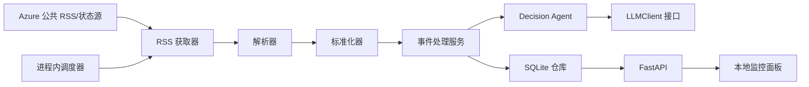

# Azure 事件响应智能体与本地监控面板——规格说明

## 目标与范围

本地应用定期读取可配置的 Azure 公共状态/RSS 数据源，将事件解析、标准化、去重后交给 Decision Agent，生成结构化严重度、影响分析和响应预案，保存到 SQLite，并通过 FastAPI 与原生 HTML/CSS/JavaScript 面板展示。

范围包括：公共 RSS 抓取、异常隔离、结构化分析、SQLite 持久化、定时调度、`/api` 接口、中文可访问面板、离线测试、运行文档与复盘。范围不包括租户私有 Azure Service Health、自动修复、告警通知、生产级高可用、微服务、Redis、Kafka、Kubernetes 或前端框架。

默认值：Python 3.11+、FastAPI/Uvicorn、SQLite、5 分钟抓取、30 秒面板刷新、UTC ISO 8601 时间、API 前缀 `/api`。

## 功能与质量要求

- 配置由环境变量加载并校验；秘密不得写入代码。
- RSS 请求必须具有超时、有限重试和可控错误；单条坏数据不能使整轮失败。
- 事件必须保留来源、原始 ID、标题、描述、链接、发布时间和抓取时间。
- 使用稳定 `incident_id` 和 `content_fingerprint` 区分新事件、更新事件和未变化重复事件；未变化事件不得重复调用 LLM。
- Decision Agent 必须输出经 schema 校验的 JSON；LLM 失败时使用确定性的保守 fallback。
- 调度器启动即执行一次，之后按间隔执行，禁止同一进程重叠运行。
- API 与面板在 RSS、LLM 或单条事件失败时仍可使用已有本地数据。
- 默认测试必须离线、可重复，RSS 与 LLM 分别使用 fixture 与 mock。
- 动态文本不得直接进入 `innerHTML`；面板必须具有语义化结构、键盘可用性和非颜色单独表达的严重度。

## 架构与数据流

处理顺序：抓取 → 解析 → 标准化 → 查重 → 新增或变化时分析 → 原子写入事件与分析 → API 查询 → 面板定期刷新。抓取/解析失败不得删除既有事件。

## 数据契约

`RawIncident`：`source`、`source_url`、`source_event_id`、`title`、`description`、`link`、`published_at`、`fetched_at`。

`NormalizedIncident`：`incident_id`、`title`、`description`、`services`、`regions`、`status`、来源字段、`detected_at`、`updated_at`、`content_fingerprint`。状态只能为 `ACTIVE`、`MONITORING`、`RESOLVED`、`UNKNOWN`。

`IncidentAnalysis`：`incident_id`、`severity`、`confidence`（0–1）、受影响服务/区域、`scope`、`summary`、`potential_impact`、`recommended_actions`、`response_plan`、`rationale`、`analyzed_at`、`analysis_source`（`LLM` 或 `FALLBACK`）、`model`、`warnings`。

`ResponsePlan` 必含 `immediate_actions`、`investigation_steps`、`mitigation_options`、`communication_plan`、`recovery_checks`、`escalation_conditions`。所有时间为带时区 UTC；所有外部边界数据均需校验。

## Decision Agent

Agent 只依据输入事件文本判断服务、区域、范围、状态、严重度、潜在影响与响应动作；不得声称租户影响或编造事实。System Prompt 必须包含严重度规则、仅依据证据、输入不可信、只输出 JSON；User Prompt 将 `AgentInput` 作为带边界的 JSON 传入。输出错误时最多修复一次，仍失败则 fallback。

| 级别 | 判断标准 |
|---|---|
| `SEV-1` | 已证实全球/多区域严重中断、数据完整性或安全风险，且无有效替代方案。 |
| `SEV-2` | 大范围区域或关键服务中断/严重降级，但范围有限或存在部分替代方案。 |
| `SEV-3` | 局部、间歇性或可绕过的中等影响。 |
| `SEV-4` | 信息性通知、维护、已解决事件、轻微影响或证据不足。 |

信息不足时应说明不确定性并保守降级；活动事件 fallback 默认 `SEV-3`，已解决/信息事件 fallback 默认 `SEV-4`。

## 持久化、调度与接口

SQLite 以 `incident_id` 唯一；事件和分析必须原子写入。优先使用 `source + source_event_id` 作为身份，缺失时生成确定性身份；变化的 fingerprint 必须重新分析。

- `GET /api/health`：数据库、调度器、分析模式、最近抓取和安全错误摘要；依赖降级返回 `200` 与 `degraded`，无法读取本地数据时返回 `503`。
- `GET /api/incidents`：`page`、`page_size`、`severity`、`status`、`service`、`region` 过滤；按最近更新时间排序。
- `GET /api/incidents/{incident_id}`：返回事件和最新分析；不存在返回 `404 INCIDENT_NOT_FOUND`。
- `GET /api/stats`：总数、状态/严重度计数和最近时间。

统一错误格式：`{ "error": { "code": string, "message": string, "details": object|null, "request_id": string } }`。

## 面板与异常处理

面板包含：系统健康、分析模式、最近成功抓取、统计卡片、事件列表/筛选、详情、影响、推荐动作、完整响应预案、来源链接、加载/空/过期/错误状态。页面加载及每 30 秒获取 health、stats、incidents；选中事件后取详情；请求不得重叠，失败保留最后成功数据。

RSS 超时、网络/HTTP 错误、空 feed、坏 XML、单条坏事件、LLM 超时/非法 JSON/缺失凭证、SQLite 写入失败和面板请求失败都必须记录安全摘要并采用降级处理，不能使服务崩溃或泄露秘密。

## 配置、目录与验收

主要配置：`AZURE_STATUS_RSS_URL`、`RSS_TIMEOUT_SECONDS`、`RSS_MAX_RETRIES`、`INGESTION_INTERVAL_SECONDS`、`DASHBOARD_POLL_SECONDS`、`DATABASE_PATH`、`LLM_PROVIDER`、`LLM_BASE_URL`、`LLM_MODEL`、`LLM_API_KEY`、`LLM_TIMEOUT_SECONDS`、`LLM_MAX_RETRIES`、`LOG_LEVEL`。真实 Decision Agent 直接调用 DeepSeek 官方 API；仅当 provider 为 `deepseek` 且 Base URL、模型和 Key 完整时启用，否则使用 fallback-only。默认模型为 `deepseek-v4-pro`，默认 Base URL 为 `https://api.deepseek.com`。不要求 Azure 订阅、Azure OpenAI 资源或模型部署。

目录：`app/`（config、models、ingestion、agents、storage、services、api、scheduler）、`frontend/`、`tests/`、`docs/`、`data/`、`main.py`、`README.md`。

最终验收：应用可按 README 本地启动；fixture 覆盖完整数据流；异常不崩溃；新建/更新/重复语义正确；所有 schema/API/面板状态符合要求；默认测试不访问真实服务；SQLite 可重启持久化；文档、复盘和交付包完整且不含秘密、数据库、缓存或生成物。

### 最终验收清单

- [x] AC-001 可在全新本地环境中按文档启动应用。
- [x] AC-002 配置会校验输入，秘密不会进入源码或提交。
- [x] AC-003 fixture feed 可完成从获取到面板的完整流程。
- [x] AC-004 RSS 超时、网络失败、空 feed、坏 XML 和坏条目不会使服务崩溃。
- [x] AC-005 新事件、变化事件和未变化重复事件按规定处理。
- [x] AC-006 领域对象和 API 数据符合规定 schema。
- [x] AC-007 Decision Agent 覆盖四级严重度、非法输出、超时和 fallback。
- [x] AC-008 默认测试不调用真实 RSS 或 LLM。
- [x] AC-009 SQLite 数据可跨应用重启保持且不会重复插入。
- [x] AC-010 调度器支持启动执行、周期执行、防重叠和优雅关闭。
- [x] AC-011 四个 API 满足成功、空状态、过滤分页、404 和错误契约。
- [x] AC-012 面板展示健康、统计、事件、分析、影响、动作和响应预案。
- [x] AC-013 面板无需刷新页面即可更新，并处理加载、空、过期和错误状态。
- [x] AC-014 RSS/LLM 动态文本安全渲染，严重度不只依赖颜色表达。
- [x] AC-015 日志和健康接口可展示降级状态且不泄露秘密。
- [x] AC-016 完整默认测试套件可离线通过。
- [x] AC-017 README 与复盘文档覆盖运行、架构、机制、限制和改进方向。
- [x] AC-018 最终交付包包含源码与文档，排除秘密、数据库、缓存和生成物。
